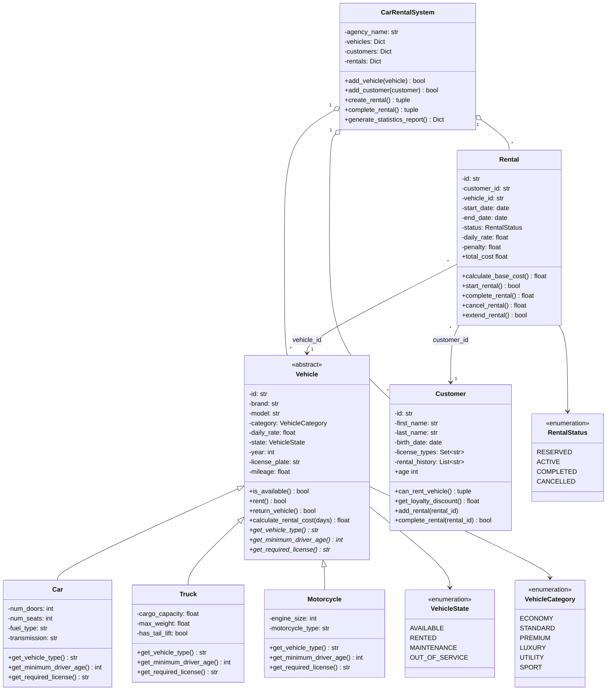

# Diagramme UML de Classes - Système de Location de Voitures

## Diagramme en PlantUML

```plantuml
@startuml CarRentalSystem

' Configuration du style
skinparam classAttributeIconSize 0
skinparam classFontStyle bold
skinparam packageFontStyle bold
skinparam linetype ortho

' ========== ENUMERATIONS ==========

enum VehicleState {
    AVAILABLE : "disponible"
    RENTED : "loué"
    MAINTENANCE : "en maintenance"
    OUT_OF_SERVICE : "hors service"
}

enum VehicleCategory {
    ECONOMY : "économique"
    STANDARD : "standard"
    PREMIUM : "premium"
    LUXURY : "luxe"
    UTILITY : "utilitaire"
    SPORT : "sport"
}

enum RentalStatus {
    RESERVED : "réservée"
    ACTIVE : "en cours"
    COMPLETED : "terminée"
    CANCELLED : "annulée"
}

' ========== CLASSES VEHICULES ==========

abstract class Vehicle {
    - _id : str
    - _brand : str
    - _model : str
    - _category : VehicleCategory
    - _daily_rate : float
    - _state : VehicleState
    - _year : int
    - _license_plate : str
    - _mileage : float
    - _maintenance_history : List[dict]
    - _last_maintenance_date : Optional[date]
    --
    + id : str <<property>>
    + brand : str <<property>>
    + model : str <<property>>
    + category : VehicleCategory <<property>>
    + daily_rate : float <<property>>
    + state : VehicleState <<property>>
    + year : int <<property>>
    + license_plate : str <<property>>
    + mileage : float <<property>>
    + maintenance_history : List[dict] <<property>>
    --
    + is_available() : bool
    + rent() : bool
    + return_vehicle(new_mileage: float) : bool
    + send_to_maintenance(description: str) : bool
    + complete_maintenance(description: str, cost: float) : bool
    + needs_maintenance(km_threshold: float) : bool
    + calculate_rental_cost(days: int) : float
    + to_dict() : dict
    + {abstract} get_vehicle_type() : str
    + {abstract} get_minimum_driver_age() : int
    + {abstract} get_required_license() : str
}

class Car {
    - _num_doors : int
    - _num_seats : int
    - _fuel_type : str
    - _transmission : str
    --
    + num_doors : int <<property>>
    + num_seats : int <<property>>
    + fuel_type : str <<property>>
    + transmission : str <<property>>
    --
    + get_vehicle_type() : str
    + get_minimum_driver_age() : int
    + get_required_license() : str
    + to_dict() : dict
}

class Truck {
    - _cargo_capacity : float
    - _max_weight : float
    - _has_tail_lift : bool
    --
    + cargo_capacity : float <<property>>
    + max_weight : float <<property>>
    + has_tail_lift : bool <<property>>
    --
    + get_vehicle_type() : str
    + get_minimum_driver_age() : int
    + get_required_license() : str
    + to_dict() : dict
}

class Motorcycle {
    - _engine_size : int
    - _motorcycle_type : str
    --
    + engine_size : int <<property>>
    + motorcycle_type : str <<property>>
    --
    + get_vehicle_type() : str
    + get_minimum_driver_age() : int
    + get_required_license() : str
    + calculate_rental_cost(days: int) : float
    + to_dict() : dict
}

' ========== CLASSE CLIENT ==========

class Customer {
    - _id : str
    - _first_name : str
    - _last_name : str
    - _birth_date : date
    - _license_number : str
    - _license_types : Set[str]
    - _license_date : date
    - _email : str
    - _phone : str
    - _address : str
    - _rental_history : List[str]
    - _active_rentals : List[str]
    - _created_at : datetime
    - _is_blocked : bool
    - _blocked_reason : Optional[str]
    --
    + id : str <<property>>
    + first_name : str <<property>>
    + last_name : str <<property>>
    + full_name : str <<property>>
    + birth_date : date <<property>>
    + age : int <<property>>
    + license_number : str <<property>>
    + license_types : Set[str] <<property>>
    + license_date : date <<property>>
    + years_of_license : int <<property>>
    + email : str <<property>>
    + phone : str <<property>>
    + address : str <<property>>
    + rental_history : List[str] <<property>>
    + active_rentals : List[str] <<property>>
    + is_blocked : bool <<property>>
    --
    + add_license_type(license_type: str) : void
    + has_license(license_type: str) : bool
    + can_rent_vehicle(required_license: str, minimum_age: int) : tuple[bool, str]
    + add_rental(rental_id: str) : void
    + complete_rental(rental_id: str) : bool
    + get_total_rentals() : int
    + block(reason: str) : void
    + unblock() : void
    + is_loyal_customer(min_rentals: int) : bool
    + get_loyalty_discount() : float
    + to_dict() : dict
}

' ========== CLASSE LOCATION ==========

class Rental {
    - _id : str
    - _customer_id : str
    - _vehicle_id : str
    - _start_date : date
    - _end_date : date
    - _actual_return_date : Optional[date]
    - _status : RentalStatus
    - _daily_rate : float
    - _start_mileage : float
    - _end_mileage : Optional[float]
    - _penalty : float
    - _created_at : datetime
    - _notes : str
    - _discount_applied : float
    --
    + {static} LATE_RETURN_PENALTY_PER_DAY : float = 50.0
    + {static} CANCELLATION_FEE_PERCENT : float = 0.20
    --
    + id : str <<property>>
    + customer_id : str <<property>>
    + vehicle_id : str <<property>>
    + start_date : date <<property>>
    + end_date : date <<property>>
    + actual_return_date : Optional[date] <<property>>
    + status : RentalStatus <<property>>
    + daily_rate : float <<property>>
    + start_mileage : float <<property>>
    + end_mileage : Optional[float] <<property>>
    + penalty : float <<property>>
    + notes : str <<property>>
    + discount_applied : float <<property>>
    + planned_duration : int <<property>>
    + actual_duration : Optional[int] <<property>>
    + days_late : int <<property>>
    + distance_traveled : Optional[float] <<property>>
    + total_cost : float <<property>>
    --
    + calculate_base_cost() : float
    + calculate_total_cost() : float
    + apply_discount(discount_percent: float) : void
    + start_rental() : bool
    + complete_rental(return_date: date, end_mileage: float) : float
    + cancel_rental() : float
    + extend_rental(new_end_date: date) : bool
    + is_overdue() : bool
    + days_remaining() : int
    + to_dict() : dict
}

' ========== CLASSE CENTRALE ==========

class CarRentalSystem {
    - _agency_name : str
    - _vehicles : Dict[str, Vehicle]
    - _customers : Dict[str, Customer]
    - _rentals : Dict[str, Rental]
    - _created_at : datetime
    --
    ' Gestion véhicules
    + add_vehicle(vehicle: Vehicle) : bool
    + remove_vehicle(vehicle_id: str) : bool
    + get_vehicle(vehicle_id: str) : Optional[Vehicle]
    + get_all_vehicles() : List[Vehicle]
    + get_available_vehicles(...) : List[Vehicle]
    + search_vehicles(...) : List[Vehicle]
    ' Gestion clients
    + add_customer(customer: Customer) : bool
    + remove_customer(customer_id: str) : bool
    + get_customer(customer_id: str) : Optional[Customer]
    + get_all_customers() : List[Customer]
    + search_customers(...) : List[Customer]
    ' Gestion locations
    + create_rental(...) : Tuple[Optional[Rental], str]
    + start_rental(rental_id: str) : Tuple[bool, str]
    + complete_rental(...) : Tuple[Optional[float], str]
    + cancel_rental(rental_id: str) : Tuple[Optional[float], str]
    + extend_rental(...) : Tuple[bool, str]
    + get_rental(rental_id: str) : Optional[Rental]
    + get_all_rentals() : List[Rental]
    + get_active_rentals() : List[Rental]
    + get_overdue_rentals() : List[Rental]
    + get_customer_rentals(customer_id: str) : List[Rental]
    + get_vehicle_rentals(vehicle_id: str) : List[Rental]
    ' Rapports
    + generate_available_vehicles_report() : Dict
    + generate_active_rentals_report() : Dict
    + generate_revenue_report(...) : Dict
    + generate_statistics_report() : Dict
    + print_report(report: Dict) : str
    ' Utilitaires
    + check_and_update_rentals() : void
    + get_summary() : Dict
}

' ========== RELATIONS ==========

' Héritage véhicules
Vehicle <|-- Car
Vehicle <|-- Truck
Vehicle <|-- Motorcycle

' Associations avec énumérations
Vehicle --> VehicleState : state
Vehicle --> VehicleCategory : category
Rental --> RentalStatus : status

' Composition/Agrégation système central
CarRentalSystem "1" o-- "*" Vehicle : gère
CarRentalSystem "1" o-- "*" Customer : gère
CarRentalSystem "1" o-- "*" Rental : gère

' Associations location
Rental "*" --> "1" Customer : customer_id
Rental "*" --> "1" Vehicle : vehicle_id

' Association client-historique
Customer "1" --> "*" Rental : rental_history

@enduml
```

## Diagramme Simplifié (Mermaid)

## Description des Relations

### Héritage (Généralisation)

| Classe Parent         | Classes Enfants              | Description                                          |
| --------------------- | ---------------------------- | ---------------------------------------------------- |
| `Vehicle` (abstraite) | `Car`, `Truck`, `Motorcycle` | Polymorphisme pour les différents types de véhicules |

### Associations

| Classe Source     | Classe Cible | Cardinalité | Description                             |
| ----------------- | ------------ | ----------- | --------------------------------------- |
| `CarRentalSystem` | `Vehicle`    | 1..\*       | Le système gère plusieurs véhicules     |
| `CarRentalSystem` | `Customer`   | 1..\*       | Le système gère plusieurs clients       |
| `CarRentalSystem` | `Rental`     | 1..\*       | Le système gère plusieurs locations     |
| `Rental`          | `Customer`   | \*..1       | Une location est associée à un client   |
| `Rental`          | `Vehicle`    | \*..1       | Une location est associée à un véhicule |
| `Customer`        | `Rental`     | 1..\*       | Un client a un historique de locations  |

### Dépendances (Énumérations)

| Classe    | Énumération       | Attribut   |
| --------- | ----------------- | ---------- |
| `Vehicle` | `VehicleState`    | `state`    |
| `Vehicle` | `VehicleCategory` | `category` |
| `Rental`  | `RentalStatus`    | `status`   |

## Principes POO Appliqués

### 1. Encapsulation

- Attributs privés (`_attribute`)
- Accès via propriétés (`@property`)
- Validation dans les setters

### 2. Héritage

- `Vehicle` comme classe de base abstraite
- Spécialisation dans `Car`, `Truck`, `Motorcycle`
- Réutilisation du code commun

### 3. Polymorphisme

- Méthodes abstraites (`get_vehicle_type`, `get_minimum_driver_age`, `get_required_license`)
- Implémentation spécifique dans chaque sous-classe
- `calculate_rental_cost` surchargé dans `Motorcycle`

### 4. Abstraction

- Classe `Vehicle` abstraite (ABC)
- Interface commune pour tous les véhicules
- Masquage de la complexité interne
